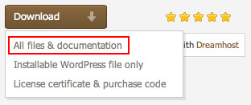
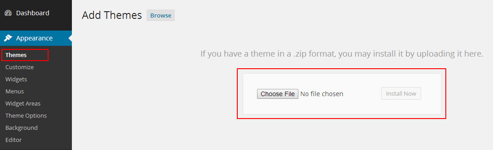

## Installation & Basic Setup

**1. Install WordPress**

* Download and Install **WordPress 5.0** or later.

**2. Upload Theme**

* If you've just downloaded whole theme package (see fig. 1), unzip it. You will find the theme installation file (called like **"theme_name_v.zip"**), user manual, dummy content folder, license folder, folder with PSD files, etc.

* Alternatively you can simply download the installation WordPress file.

* You have 2 ways to upload theme: **WordPress Installation** or **Cpanel/FTP Installation**

**3. Activate Theme**

* In **`Appearance > Themes > Manage Themes > Available Themes`** activate the Theme by clicking on the correspondent **"Activate"** link.

--- 

_**Attention!!! To make sure your permalinks are being rendered correctly (the web-site does not return "404 Not Found" error) after switching the theme, follow **`Dashboard > Settings > Permalinks`** and click "Save Changes".**_

--- 

* After activating the Theme, you will notice Theme Options and Required Plugins (**WPBakery Page Builder**, **WD Packages**, etc...) in your WordPress admin panel.

**4. Cache Theme - Uploads folder**

* If you're using FTP client, go to **`your_site/wp-content/themes/theme_name`** **CHMOD** to **777** this folder : **cache_theme**. You also change **CHMOD** to **777** for **Uploads folder**.

## Wordpress Installation

**Follow steps below to install via WordPress:**

1. In your **WordPress Admin Panel (wp-admin)** go to **`Appearance > Themes`**
2. Click on **Add New** and press the **"Upload Theme"** button
3. Navigate to find the **"theme_name_v.zip"** file on your computer and click on **"Install Now"**
4. Wait until the theme is uploaded and installed
5. Activate the newly installed theme. Go to **`Appearance > Themes`** and activate it
6. Then you will see a notification to activate the required plugins. Follow steps to install and activate. The other plugins we include are integrated into the theme and all will be ready to use.

--- 

_**Please note that some hostings impose restriction on size of a file that you are uploading. If any warnings appear, most probably, your hosting has limit on file size. And the theme .zip file is too large to be uploaded through WordPress Panel. **_

_**To solve this problem you should either increase your maximum upload size in your hosting admin panel or try to contact your hosting provider to enable it for you if you do not have right to alter your server php settings. This is a very common request and they should be able to help you out. Once the limit is increased, you can re-try to install and you’ll go ahead well. **_

_**Also, you can install the theme via FTP.**_

--- 

## Cpanel/FTP Installation

* Otherwise **you can install theme via Cpanel or FTP**. Simply upload the installable file to the theme folder **`your_site/wp-content/themes/`** via Cpanel or FTP.

1. Log into your hosting space via **Cpanel** or an **FTP software ([FileZilla](https://filezilla-project.org/), [WinSCP](https://winscp.net/eng/download.php),...)**
2. Unzip the **"theme_name_v.zip"** file and **ONLY** use the extracted theme folder
3. Upload theme folder extracted the **zip file** to **`wp-content > themes`** folder
4. Go to **`Appearance > Themes`** and **activate** it

--- 

_**Attention!!! Theme will work well on the vast majority of correctly installed and configured WordPress sites without any additional settings. However, on some (very few) hosting configurations you can notice that images on your site are not displayed.**_

--- 
* If you are experiencing this issue, please follow these steps to fix it:

1. Make sure that theme installed strictly to **`your_site/wp-content/themes/`** folder.

2. The folder **`your_site/wp-content/uploads`** must be created. On some hostings you'll need to set its **CHMOD** to **755**, on others – to **777**.

--- 

_**If above steps did not yield any result, please don’t hesitate to address this issue directly by asking your hosting company. Since this is the common server-related problem, we will not be able to help you!**_

--- 

**Important Backup Information**

* Whenever you update the theme, a good idea is to backup your current theme folder. Log into your server and make a copy of the current theme folder located at **`"wp-content > themes"`**. 

* If you are using the **Revolution Slider plugin** and added custom css, please make a backup of styles because those will be removed when you update. You can also backup your theme options on the backup tab in **`Appearance > Theme Options`**.

**Non-Production Environment**

* We notice you should use this environment to test. If there is no problem, you can tranfer to live site.

## Import Demo Data

**Demo Pages**

* After setting up